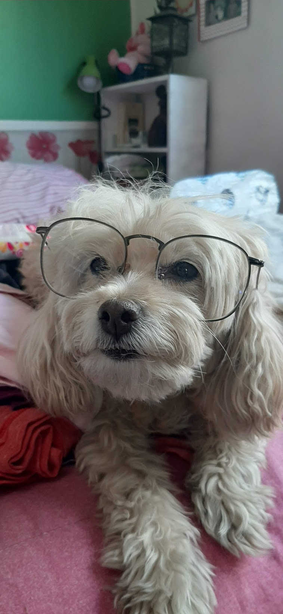

<h1 align="center">Hi 👋, I'm Andrés Cueto</h1>
<h3 align="center">A mechatronics engineer with a software background, I’m excited to keep learning and contribute to all the amazing advances in cross-functional engineering (such as robotics, automation, or embedded systems)</h3>

  

- 🔭 I’m currently working on **AI_Cover_Letter_Generator**

- 🌱 I’m currently learning **how to use AI tools (GUI/APIs) to simplify processes and tasks**

- 🤝 I’m looking for help with **breaking into the Canadian 🇨🇦 labour market to get my first engineering role here**

- 👨‍💻 Most of my projects are available at [http://bit.ly/41qt0Vq](http://bit.ly/41qt0Vq)

- 💬 Ask me about **Entrepreneurship, startups and tech innovation related to business and building the future**

- 📫 How to reach me **andrescuetoestrada@gmail.com**

- 📄 Know about my experiences [https://drive.google.com/file/d/1cyzQNInwGfTZVS2ZeTlmdamFLnv46odH/view?usp=share_link](https://drive.google.com/file/d/1cyzQNInwGfTZVS2ZeTlmdamFLnv46odH/view?usp=share_link)

- ⚡ Fun fact **I love doggos, at the end of this document you'll find a photo of mine**

<h3 align="left">Connect with me:</h3>

   

<h3 align="left">Languages and Tools:</h3>

 
   
       

        

   

Here a picture of my doggo in Mex:

